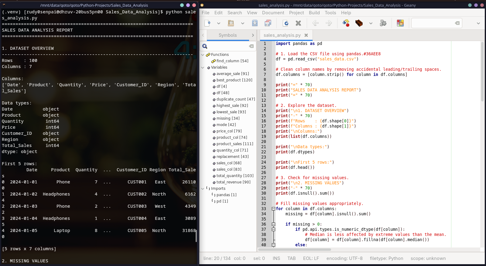
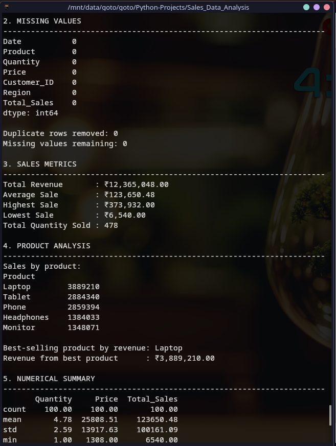
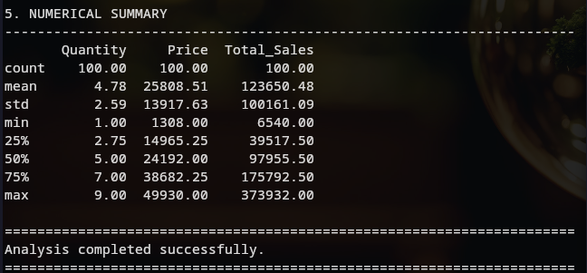

# Sales Data Analysis

## Project Overview

**Sales Data Analysis** is a Python data-analysis project developed for Week 3: *Introduction to Data Analysis - Working with Real Data*.

The project uses **Pandas** to load, clean, explore, and analyze a sales dataset stored in CSV format. It produces a terminal-based analysis report containing dataset information, missing-value checks, duplicate-row handling, sales metrics, product-level revenue analysis, and numerical summary statistics.

### Objectives

- Load real-world-style sales data from a CSV file using Pandas.
- Inspect the dataset structure, dimensions, columns, data types, and sample records.
- Detect and handle missing values appropriately.
- Detect and remove duplicate records.
- Identify important sales, quantity, product, and price columns.
- Calculate key sales metrics.
- Determine the best-selling product by total revenue.
- Generate descriptive statistics for numerical columns.
- Validate that the complete analysis executes successfully.

## Key Results

The supplied dataset contains **100 rows and 7 columns**.

| Metric | Result |
|---|---:|
| Total Revenue | ₹12,365,048.00 |
| Average Sale | ₹123,650.48 |
| Highest Sale | ₹373,932.00 |
| Lowest Sale | ₹6,540.00 |
| Total Quantity Sold | 478 units |
| Duplicate Rows | 0 |
| Missing Values | 0 |
| Best-selling Product | Laptop |
| Laptop Revenue | ₹3,889,210.00 |

## Setup Instructions

### 1. Requirements

- Linux, Windows, or macOS
- Python 3.14 or a compatible supported Python version
- `pip`
- Virtual environment support (`venv`)

### 2. Open the project directory

```bash
cd /mnt/data/goto/goto/Python-Projects/Sales_Data_Analysis
```

If the project has been copied elsewhere, use the corresponding project path.

### 3. Create a virtual environment

```bash
python -m venv .venv
```

### 4. Activate the virtual environment

Linux/macOS:

```bash
source .venv/bin/activate
```

Windows:

```powershell
.venv\Scripts\activate
```

### 5. Install dependencies

```bash
python -m pip install --upgrade pip
python -m pip install -r requirements.txt
```

### 6. Run the analysis

```bash
python sales_analysis.py
```

The script reads `sales_data.csv` from the same directory and prints the analysis report in the terminal.

### 7. Exit the virtual environment

```bash
deactivate
```

## Code Structure

```text
Sales_Data_Analysis/
├── sales_analysis.py       # Main analysis program
├── sales_data.csv          # Input sales dataset
├── requirements.txt        # Python dependency specification
├── analysis_report.md      # Written findings and interpretation
├── README.md               # Project documentation
└── screenshots/
    ├── analysis_overview.png
    ├── analysis_metrics.png
    └── analysis_summary.png
```

## Technical Details

### Architecture / Workflow

```text
sales_data.csv
      |
      v
Pandas read_csv()
      |
      v
Column-name cleaning
      |
      v
Dataset exploration
      |
      v
Missing-value detection
      |
      v
Missing-value handling
      |
      v
Duplicate detection/removal
      |
      v
Column identification
      |
      v
Sales metrics
      |
      v
Product revenue analysis
      |
      v
Numerical descriptive statistics
      |
      v
Terminal report
```

### Algorithms and Data Structures

The project primarily uses the **Pandas DataFrame**, which stores tabular data as labeled rows and columns.

#### Data loading

```python
df = pd.read_csv("sales_data.csv")
```

The CSV file is loaded into a Pandas DataFrame.

#### Column cleaning

```python
df.columns = [column.strip() for column in df.columns]
```

Leading and trailing whitespace is removed from column names so later column matching is more reliable.

#### Missing-value handling

For numeric columns, missing values are replaced with the column median:

```python
df[column] = df[column].fillna(df[column].median())
```

For non-numeric columns, the most frequent value (mode) is used. If a mode is unavailable, `"Unknown"` is used.

#### Duplicate handling

```python
duplicate_count = df.duplicated().sum()
df = df.drop_duplicates()
```

The script counts duplicate rows and then removes them.

#### Column identification

The `find_column()` function searches for common names and normalized variants of sales, quantity, product, and price fields. This makes the analysis more reusable with similarly structured datasets.

#### Product analysis

Revenue is grouped by product and sorted in descending order:

```python
product_sales = (
    df.groupby(product_col)[sales_col]
    .sum()
    .sort_values(ascending=False)
)
```

The first product after sorting is the highest-revenue product.

#### Numerical summary

```python
df.select_dtypes(include="number").describe().round(2)
```

This calculates count, mean, standard deviation, minimum, quartiles, and maximum for numerical columns.

## Visual Documentation

The screenshots below show the program executing successfully in the Linux terminal and the source code in Geany.

### Dataset Overview



### Missing Values and Sales Metrics



### Numerical Summary and Completion



## Testing Evidence

### Test Case 1 — Python environment

**Command:**

```bash
python --version
```

**Observed environment:**

```text
Python 3.14.7
```

### Test Case 2 — Dependency installation

**Command:**

```bash
python -m pip install -r requirements.txt
```

**Expected result:**

The required Pandas dependency installs successfully.

### Test Case 3 — CSV loading

**Input:**

```text
sales_data.csv
```

**Expected result:**

The script loads the dataset without a file-not-found or CSV parsing error.

**Observed result:**

100 rows and 7 columns were loaded successfully.

### Test Case 4 — Missing-value validation

**Expected result:**

Missing values are detected and handled.

**Observed result:**

```text
Date           0
Product        0
Quantity       0
Price          0
Customer_ID    0
Region         0
Total_Sales    0
```

### Test Case 5 — Duplicate validation

**Expected result:**

Duplicate rows are counted and removed.

**Observed result:**

```text
Duplicate rows removed: 0
Missing values remaining: 0
```

### Test Case 6 — Sales calculations

**Observed results:**

```text
Total Revenue       : ₹12,365,048.00
Average Sale        : ₹123,650.48
Highest Sale        : ₹373,932.00
Lowest Sale         : ₹6,540.00
Total Quantity Sold : 478
```

### Test Case 7 — Product analysis

**Observed result:**

```text
Best-selling product by revenue: Laptop
Revenue from best product      : ₹3,889,210.00
```

### Test Case 8 — End-to-end execution

**Command:**

```bash
python sales_analysis.py
```

**Expected result:**

The program completes without an exception and prints:

```text
Analysis completed successfully.
```

**Observed result:** Passed.

## Conclusion

The project successfully demonstrates the basic workflow of practical data analysis with Pandas: loading data, exploring its structure, checking data quality, cleaning records, calculating business metrics, grouping data for product analysis, and generating descriptive statistics.

The analysis shows that **Laptop** is the highest-revenue product in the supplied dataset, generating **₹3,889,210.00** in total revenue.
